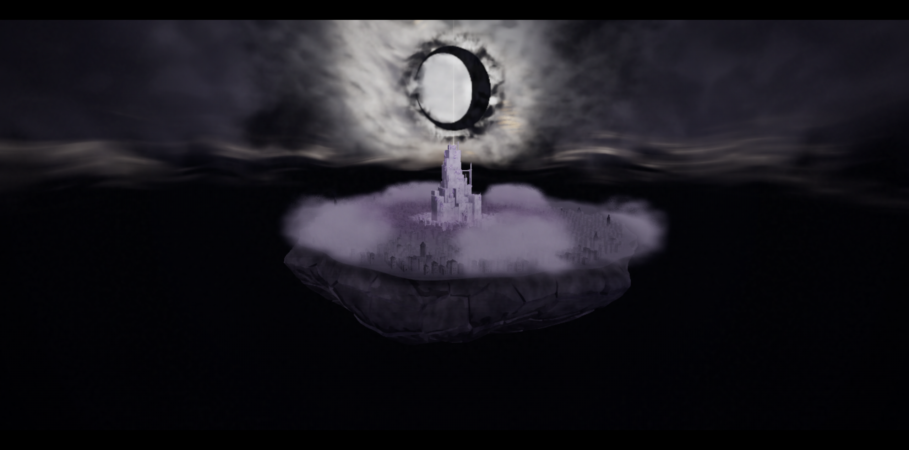

# Black Moon — Wahr Welt

Интерактивный WebGPU tribute по мотивам **BLEACH**: парящий город Wahr Welt,
цитадель и чёрный полумесяц среди живых облаков. Непрерывный 76-секундный
пролёт ведёт от ночной улицы к появлению Гетсуги и раскрытию острова.
В режиме «Кадры» камера удерживает один из десяти ракурсов, а атмосфера
продолжает двигаться.

**[Парящий город](https://bleach-webgpu.vercel.app/?film=tour&view=frames&paused&t=76&motion=1)** ·
[Смотреть кино](https://bleach-webgpu.vercel.app/?film=tour) ·
[Главная](https://bleach-webgpu.vercel.app/)



## Что уже есть

- Город с улицами, кварталами и лестницами; 1152 дополнительных здания и 12 башен на окраинах.
- Цельное скальное основание с объёмными разломами, неровными сколами и шероховатой минеральной фактурой.
- Высокая цитадель с окружающими пристройками, небольшими проёмами, материалом камня и объёмными кристаллами.
- Мягкое AO архитектуры, читаемые тени и локальная цветовая обработка.
- Лунная материя, контурное свечение, узкий световой крест и несколько слоёв облаков.
- Подвижный низкий туман, который постепенно открывает крыши и башни; тёмная полоса неба между городом и верхней погодой.
- «Кино» и десять живых «Кадров», быстрые переходы с приближением и размазыванием цвета, пауза атмосферы и скрытие панели.

Главная сохраняет закреплённую камеру и открывает режимы кнопками «Кино» / «Кадры».
Свободный осмотр доступен по `?inspect=upper`; ранний 26-секундный cinematic
сохранён отдельно по `?film`.

## Запуск

Нужны **Node.js 22.15+ в ветке 22** (проверено на 22.22.2), **pnpm 11.11.0**
и браузер с работающим WebGPU. Первая загрузка включает создание геометрии,
объёмных текстур и компиляцию шейдеров; дождитесь окончания загрузки.

```bash
corepack enable
pnpm install --frozen-lockfile
pnpm dev
```

Открыть [localhost:4321](http://localhost:4321/).
Для просмотра с другого устройства нужен HTTPS; локальный `localhost` работает
без сертификата. Сцена проверяется прежде всего на настольном браузере.
Если WebGPU недоступен, приложение показывает отдельный экран с объяснением
и кнопкой повторной проверки. Он также обрабатывает недоступную видеокарту
и незащищённое HTTP-соединение. Название браузера не ограничивается: проверяются
реальный WebGPU backend и доступное устройство; перехода на WebGL нет.

## Управление

В «Кадрах» стрелки ←/→ переключают ракурс. Кнопка Ⅱ останавливает движение
внутри кадра. ⌄ скрывает панель; ☰ или H возвращают её. В «Кино» доступны
пауза и шкала времени. Предпочтение уменьшенного движения учитывается.

В свободном осмотре:


| Действие | Управление |
| --- | --- |
| Вращение | Перетаскивание левой кнопкой мыши |
| Приближение | Колесо мыши |
| Сдвиг камеры | Перетаскивание правой кнопкой мыши |
| Движение по плоскости | W / A / S / D |
| Опустить / поднять камеру | Q / E или кнопки «НИЖЕ» / «ВЫШЕ» |
| Ускорить движение | Shift |
| Готовые ракурсы | 1–5 |
| Движение облаков | Кнопка паузы в панели GETSUGA |

Верхняя панель позволяет переключить улицу, квартал, город, цитадель и луну.
Подробности: [режимы и параметры URL](docs/CONTROLS.md).

## Сборка и проверки

```bash
pnpm build
pnpm preview
pnpm check
```

`build` проверяет TypeScript и собирает статический сайт в `dist/`.
`check` проверяет типы, цитадель и проёмы, атмосферу, замкнутость острова,
непрерывность маршрута, попадание объектов в кадр и переходы.
Эти проверки не заменяют просмотр реального WebGPU-кадра: после изменения
шейдеров или геометрии нужно проверить сцену и управление в браузере.

## Документация

- [Устройство сцены и активные модули](docs/ARCHITECTURE.md)
- [Камера, режимы и параметры URL](docs/CONTROLS.md)
- [Публикация на Vercel и обновления](docs/DEPLOYMENT.md)
- [Состояние опубликованной версии](docs/RELEASE.md)

Стек: Three.js r185, WebGPU / TSL, TypeGPU, TypeScript и Vite.
Основная геометрия, облака и материалы создаются кодом. В репозитории также
сохранены ранние модули сцены; активные и архивные пути отмечены в документации.

Это неофициальная фанатская работа, не связанная с официальным производством BLEACH.
