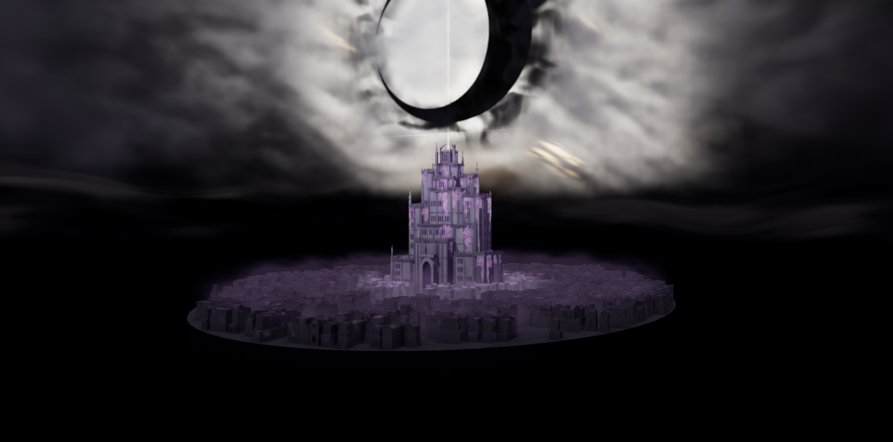

# Black Moon — Wahr Welt

Интерактивный WebGPU tribute по мотивам **BLEACH**: город Wahr Welt,
ступенчатая цитадель, фиолетовые кристаллы и чёрный полумесяц среди живых облаков.
Сцена строится и освещается в реальном времени. Главная показывает закреплённый
ракурс на луну и цитадель с живыми облаками; «Осмотреть сцену» открывает свободную камеру.

**[Открыть сцену](https://bleach-webgpu.vercel.app/)** · [Цитадель и луна](https://bleach-webgpu.vercel.app/?inspect=upper)



## Что уже есть

- Процедурный город с кварталами, улицами, террасами и лестницами.
- Цитадель с реальными углублёнными проёмами, каменным обрамлением входа и подходом с верхней дороги.
- Мягкое AO архитектуры, отдельные чёткие тени цитадели и фиолетовые кристаллические наросты.
- Объёмные облака, плотная лунная материя, рассеянное контурное свечение и узкий световой крест над цитаделью.
- Светящаяся городская дымка, тёмный ночной промежуток и дальние подсвеченные облачные гряды.
- Свободная камера, управление высотой, готовые ракурсы и отдельная пауза движения облаков.

Главная — фиксированный ракурс; свободный осмотр доступен по `?inspect=upper`. Исторический 26-секундный cinematic доступен
по `?film`; его монтаж и художественная доводка продолжаются отдельно.

## Запуск

Нужны **Node.js 22.15+ в ветке 22** (проверено на 22.22.2), **pnpm 11.11.0**
и браузер с работающим WebGPU. Первая загрузка включает создание геометрии,
объёмных текстур и компиляцию шейдеров; дождитесь окончания загрузки.

```bash
corepack enable
pnpm install --frozen-lockfile
pnpm dev
```

Открыть [localhost:4321](http://localhost:4321/).
Для просмотра с другого устройства нужен HTTPS; локальный `localhost` работает
без сертификата. Сцена проверяется прежде всего на настольном браузере.
Если WebGPU недоступен, приложение показывает отдельный экран с объяснением
и кнопкой повторной проверки. Он также обрабатывает недоступную видеокарту
и незащищённое HTTP-соединение. Название браузера не ограничивается: проверяются
реальный WebGPU backend и доступное устройство; перехода на WebGL нет.

## Управление

| Действие | Управление |
| --- | --- |
| Вращение | Перетаскивание левой кнопкой мыши |
| Приближение | Колесо мыши |
| Сдвиг камеры | Перетаскивание правой кнопкой мыши |
| Движение по плоскости | W / A / S / D |
| Опустить / поднять камеру | Q / E или кнопки «НИЖЕ» / «ВЫШЕ» |
| Ускорить движение | Shift |
| Готовые ракурсы | 1–5 |
| Движение облаков | Кнопка паузы в панели GETSUGA |

Верхняя панель позволяет переключить улицу, квартал, город, цитадель и луну.
Подробности: [режимы и параметры URL](docs/CONTROLS.md).

## Сборка и проверки

```bash
pnpm build
pnpm preview
pnpm check
```

`build` проверяет TypeScript и собирает статический сайт в `dist/`.
`check` проверяет типы, геометрию цитадели, её проёмы и поля атмосферы.
Эти проверки не заменяют просмотр реального WebGPU-кадра: после изменения
шейдеров или геометрии нужно проверить сцену и управление в браузере.

## Документация

- [Устройство сцены и активные модули](docs/ARCHITECTURE.md)
- [Камера, режимы и параметры URL](docs/CONTROLS.md)
- [Публикация на Vercel и обновления](docs/DEPLOYMENT.md)
- [Состояние первой публичной версии](docs/RELEASE.md)

Стек: Three.js r185, WebGPU / TSL, TypeGPU, TypeScript и Vite.
Основная геометрия, облака и материалы создаются кодом. В репозитории также
сохранены ранние модули сцены; активные и архивные пути отмечены в документации.

Это неофициальная фанатская работа, не связанная с официальным производством BLEACH.
