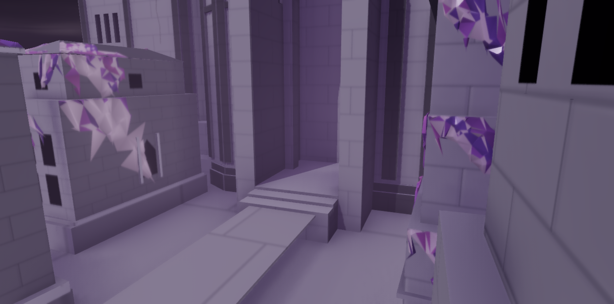
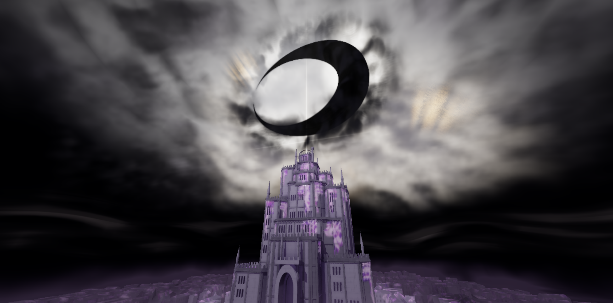

# Первый публичный снимок — 10 сентября 2026

Публикуется текущая версия свободного осмотра Wahr Welt, цитадели и чёрной
луны. Архитектура использует светлый камень с фиолетовыми участками,
смягчённое AO, читаемые тени и кристаллическое покрытие. Городская дымка
отделена тёмным ночным промежутком от верхней погоды.

Последняя архитектурная доработка — вход цитадели: внутреннее обрамление
арки доведено до основания, площадка соединена с фундаментом, короткий
лестничный подъём согласован с высотой существующей дороги.

## Проверки

Геометрические проверки текущего снимка включают открытый верхний свод,
проход под аркой, опоры внутреннего обрамления и непрерывный подъём к порогу.
336 фасадных проёмов проверяются 2016 лучевыми пробами; кристаллическое
покрытие не должно заполнять их объёмы.

В локальном аппаратном просмотре проверены общая композиция, близкий вход,
фронтальный и боковые ракурсы, реальные действия мышью и подъём камеры.
Проверка стыка города и цитадели выполнена по фактическим поверхностям обеих
моделей в трёх поперечных точках прохода.

## Границы версии

Это развивающаяся художественная сцена. Финальная хореография cinematic,
обработка кристаллов и дальнейшая детализация архитектуры остаются отдельными
этапами. Производительность зависит от GPU, разрешения и доступности WebGPU;
гарантии одинаковой частоты кадров на телефоне и настольном ПК нет.

Публичный репозиторий содержит исходники, необходимые ресурсы, проверки и
документацию. Рабочие референсы, сторонние кадры, большие записи отладки и
локальные истории сессий в этот снимок не входят.

## Публичная проверка

На https://bleach-webgpu.vercel.app/ проверены загрузка по HTTPS без входа,
соответствие опубликованных JS/CSS локальной сборке, реальный WebGPU-кадр
города и верхнего события. Переключение камеры, вращение мышью, подъём E,
движение и пауза облаков работают. В проверенном сеансе ошибок JavaScript
и потери GPU не было. Это проверка работоспособности, а не обещание частоты
кадров на любом устройстве.

## Главная и экран WebGPU

Главная теперь открывается на закреплённом ракурсе `UPPER_SHOT_PRESETS.final`.
Перетаскивание, колесо и клавиши не перемещают камеру; атмосфера остаётся
живой. Кнопка «Осмотреть сцену» открывает свободную камеру отдельно.
Проверены настольный кадр и адаптация к экрану 390×844.

При недоступном WebGPU показывается пояснение о необходимом браузере,
нейтральная подсказка и рабочая кнопка «Проверить снова». Проверены отсутствие
API, недоступный и отклонённый адаптер, HTTP, мобильная компоновка и повторная
загрузка. Проверка этих веток не создаёт дополнительную 3D-сцену.

## Строгий допуск WebGPU и граница облаков

Проверка не зависит от названия браузера. Renderer создаётся с единственным
WebGPU backend, без автоматического перехода на WebGL. До создания мира
подтверждается настоящий GPUDevice; ошибка кадра или потеря GPU скрывает
canvas и снимает статус готовности.

В готовой сборке проверены семь сценариев отказа, включая отказ адаптера
после предварительной проверки и отказ requestDevice: WebGL ни разу не
запрашивался. В успешном запуске подтверждены GPUDevice, GPUCanvasContext,
отрисовка и завершение очереди GPU. Искусственная ошибка draw скрыла сцену.
Проверка с нейтральным user-agent подтверждает отсутствие фильтра по имени,
но не заменяет отдельные прогоны в разных браузерных движках.

Диагональный разрез облаков в высоком city-ракурсе вызывала дальняя граница
камеры 2200. Все пресеты общего AO-мира теперь используют 4200. Проверены
высокий, боковой, обратный и косой ракурсы; текстура, плотность, освещение
и форма облаков не менялись.
